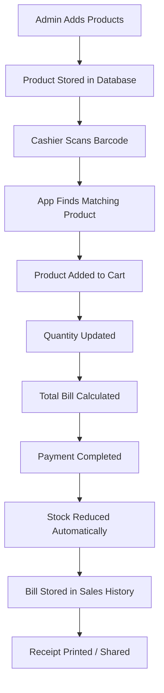

# POS System Workflow

Below is the workflow for the Point of Sale (POS) application we are building.

## Detailed Steps

1. **Admin adds products**: The administrator enters product details (name, price, barcode, stock quantity, category, image/icon) through an admin interface.
2. **Product stored in database**: The product is saved securely in the database.
3. **Cashier scans barcode**: At checkout, the cashier uses a barcode scanner (or camera-based scanner) to scan a product barcode.
4. **App finds matching product**: The system queries the database to find the product associated with that barcode.
5. **Product added to cart**: The matching product is appended to the cashier's active cart.
6. **Quantity updated**: The cashier can modify the item quantity, or scan the same barcode again to increment it.
7. **Total bill calculated**: The app dynamically computes subtotals, tax, discounts, and the final grand total.
8. **Payment completed**: The cashier registers the payment method (cash, card, mobile payment, etc.) and completes the transaction.
9. **Stock reduced automatically**: The system deducts the purchased quantities from the database inventory.
10. **Bill stored in sales history**: The completed transaction is archived in a sales log database for reporting.
11. **Receipt printed/shared**: The app generates a printable receipt receipt or digital copy (PDF/Email/SMS share) for the customer.
